# Webová anketa - školní projekt v Node.js a Express

## Zadání
### Cíl úlohy
Cílem úlohy je vytvoření serverové aplikace v Node.js s využitím frameworku Express, která umožní vytvářet, odesílat a analyzovat jednoduchou anketu zaměřenou na sport a tělesné aktivity ve webovém formuláři. 

Aplikace bude uchovávat data odpovědí v souboru ve formátu JSON a využije EJS pro vykreslení stránek s výsledky ankety.

### Základní požadavky
* Vyplnění ankety: Umožněte uživatelům prostřednictvím webového formuláře vyplnit vaši anketu. Každá anketa by měla obsahovat název, bližší popis a libovolný počet otázek (otevřené nebo uzavřené typy).
* Zobrazení výsledků: Vytvořte funkci pro zobrazení výsledků ankety, včetně počtu a procentuálního rozdělení odpovědí pro uzavřené otázky a seznamu odpovědí pro otázky otevřené.
* Ukládání odpovědí: Odpovědi na anketu ukládejte do souboru responses.json ve formátu JSON. Každá odpověď by měla obsahovat ID ankety, odpovědi uživatele a časové razítko odeslání.
* Dynamické vykreslování stránek: Použijte EJS k vykreslení stránek, včetně formuláře pro odpovědi a stránek pro zobrazení výsledků. Pro každou část aplikace vytvořte samostatnou EJS šablonu.
* Vylepšení uživatelského rozhraní: Implementujte pokročilé funkce pro lepší uživatelský komfort, například validaci formulářů nebo interaktivní grafy pro zobrazení statistik.

### Technické detaily
* Pro práci se soubory použijte modul fs z Node.js.
* Použijte body-parser pro zpracování dat odeslaných formuláři.
* Vytvořte přehledný kód aplikace
* Ujistěte se, že všechny stránky jsou responzivní a funkční na různých zařízeních.
* Řešení umístěte na Githubu a odevzdejte adresu své aplikace.
---
## Postup práce
### Inicializace projektu
1. **Vytvoření složky projektu**: Začněte vytvořením nové složky pro váš projekt a otevřením této složky v příkazové řádce nebo terminálu.
	```
    mkdir node-anketa
    cd node anketa
    ```
2. **Inicializace NPM**: Spusťte `npm init` k vytvoření souboru `package.json`, který bude spravovat závislosti vašeho projektu. 
	```    
    npm init
    ```
3. **Instalace závislostí**: Instalujte balíčky *Express*, *EJS* a *body-parser* pomocí npm:    
	```    
    npm install express ejs body-parser
    ```
4. **Vytvoření souboru README.md**: Vytvořte soubor README.md a popisujte v něm postupně kroky při tvorbě tohoto projektu. 
Naučte se používat jazyk [markdown](https://www.markdownguide.org/cheat-sheet/#downloads).
5. **Vytvoření souboru .gitignore**: Vytvořte soubor .gitignore a nastavte v něm, aby při ukládání do repozitáře gitu byla ignorována složka `node_modules`.
6. **Vytvoření nového lokálního repozitáře GIT**:
    - `git init`
    - `git config user.name "uzivatel_na_githubu"`
    - `git config user.email "email_na_githubu"`
7. **Vytvoření nového vzdáleného repozitáře na Githubu**: Nazvěte ho např. `webova_anketa`
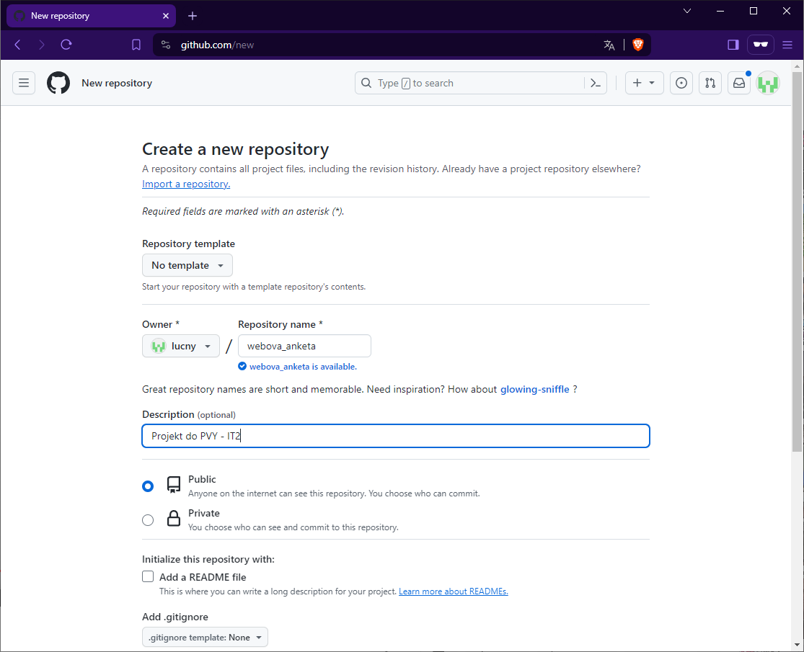
8. **Úvodní commit do lokálního repozitáře**:
    - `git add .`
    - `git commit -m "Inicializace projektu"`
9. **Vytvoření a aktivace ssh klíče**: viz např. [Add a SSH Key to Github](https://www.youtube.com/watch?v=iVJesFfzDGs)   
10. **Propojení repozitářů a jejich synchronizace**: Využijte dobrých rad z Githubu:
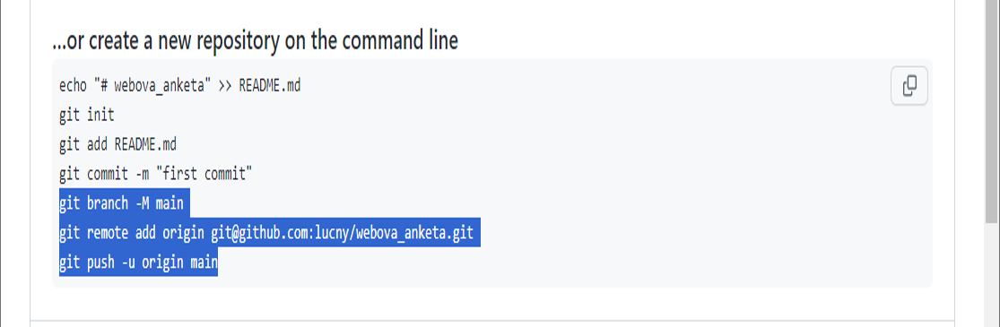
    - `git remote add origin git@github.com:nejake_jmeno/webova_anketa.git`
    - `git push -u origin main`

---
### Vytvoření serveru a nastavení routování
1. **Vytvoření indexu.js**: Vytvořte soubor index.js, připojte v něm potřebné knihovny a aktivujte webový server.
	```    
    const express = require('express');
    const bodyParser = require('body-parser');
    const fs = require('fs');
    const app = express();
    const PORT = 3000;

    app.use(bodyParser.urlencoded({ extended: true }));
    app.use(express.static('public')); // pro statické soubory (CSS, JS)
    app.set('view engine', 'ejs'); // nastavení EJS jako šablonovacího nástroje

    app.listen(PORT, () => {
    console.log(`Server běží na portu ${PORT}`);
    });
	```    
2. **Testovací spuštění serveru**:
    - `node index.js` nebo jen `node .`
    - pro testování raději nainstalujte `npm i nodemon -g` a poté lze server spouštět `nodemon .`
    - je rovněž vhodné upravit v souboru `package.json` sekci `scripts`:
	```  
    ...  
    "scripts": {
        "test": "echo \"Error: no test specified\" && exit 1",
        "start": "node index.js"
    }, 
    ...   
	```
    - a poté lze serverovou aplikaci spouštět také `npm start`    
3. **Nastavení routování**: Nyní si můžeme připravit základní **routy**, tedy URL adresy, na které bude možné odesílat požadavky.
    Do souboru `index.js` přidáme následující kód:
	```  
    ...
    /* Routa pro zobrazení úvodní stránky */ 
    app.get('/', (req, res) => {
        // Zde, na úvodní stránce, budeme zobrazovat formulář pro vyplnění ankety
        res.render('index', { title: 'Webová anketa' }); // index.ejs je soubor šablony
    });

    /* Routa pro zpracování dat z formuláře */
    app.post('/submit', (req, res) => {
        // Zde budeme ukládat data z formuláře do souboru responses.json
        res.redirect('/results'); // Po uložení dat přesměrujeme uživatele na stránku s výsledky
    });

    /* Routa pro zobrazení výsledků ankety */
    app.get('/results', (req, res) => {
        // Zde bude načtení dat ze souboru responses.json a jejich předání do šablony
        res.render('results', { title: 'Výsledky ankety' }); // results.ejs je soubor šablony
    });
    ...    
	```  
4. **Vytvoření šablon**: 
    - V základní složce projektu založíme složku `views`
    - Ve složce `views` vytvoříme soubory `index.ejs` a `results.ejs`:
    
    *Šablona index.ejs*
    ```
    <!DOCTYPE html>
    <html lang="cs">
    <head>
        <meta charset="UTF-8">
        <meta name="viewport" content="width=device-width, initial-scale=1.0">
        <title>Webová anketa</title>
    </head>
    <body>
        <h1>Webová anketa</h1>
    </body>
    </html>
    ```

    *Šablona results.ejs*
    ```
    <!DOCTYPE html>
    <html lang="cs">
    <head>
        <meta charset="UTF-8">
        <meta name="viewport" content="width=device-width, initial-scale=1.0">
        <title>Výsledky ankety</title>
    </head>
    <body>
        <h1>Výsledky ankety</h1>
    </body>
    </html>
    ```    
5. **Připojení CSS**: 
    - V základní složce projektu založíme složku `public`, v níž budou statické soubory (CSS, JS, grafické přílohy apod.)
    - Ve složce `public` vytvoříme podsložku `css` a soubor `styles.css`. Vložíme do něj několik CSS pravidel:
    
    *Statický soubor styles.css*
    ```
    body {
        font-family: Arial, sans-serif;
        background-color: #f4f4f4;
        margin: 0;
        padding: 0;
    }


    h1 {
        color: white;
        background-color: blue;
        font-size: 30pt;
        padding: 10px;
        margin: 0;
    }    
    ```
    - Tento soubor připojíme k oběma šablonám pomocí `<link rel="stylesheet" href="css/styles.css">`
6. **Ověření funkčnosti webu**: Aktuální stav našeho webového serveru prověříme jeho spuštěním a zadáním URL adres v prohlížeči:
    
   [http://localhost:3000/](http://localhost:3000/)
   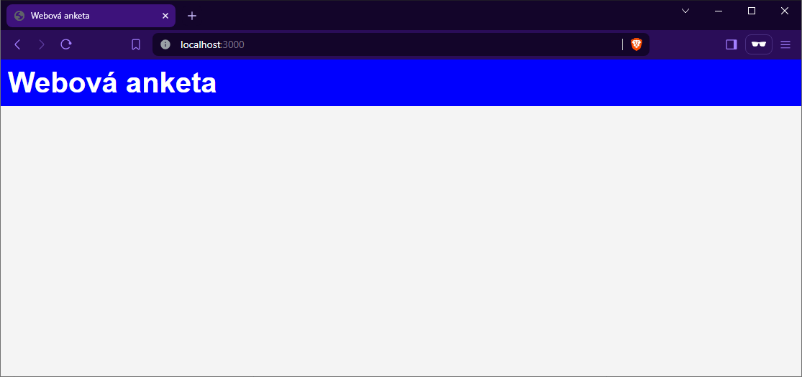

   [http://localhost:3000/results](http://localhost:3000/results)
   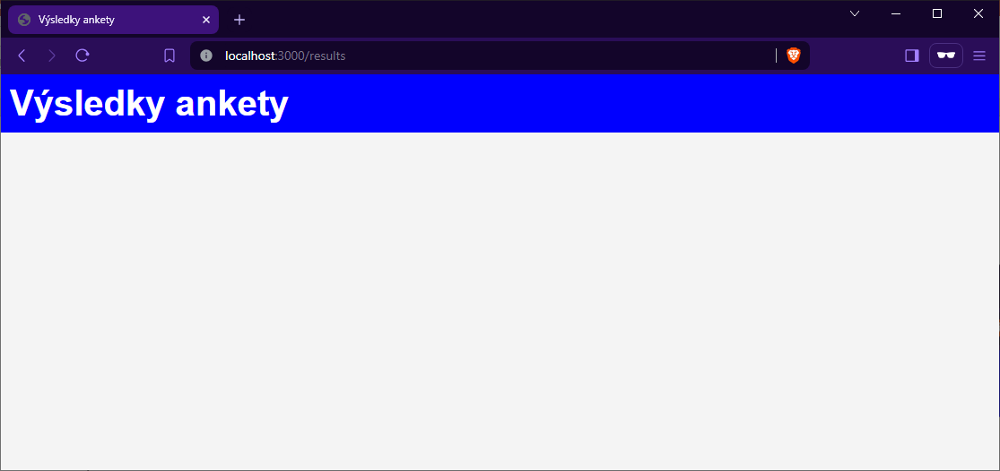

---
### Vytvoření formuláře na domovské stránce
1. **Návrh ankety**: 
Zamýšlená anketa bude zaměřena na význam sportu a pohybu v životě studentů. Součástí ankety budou následujcí typy otázek:
- Průměrný počet hodin, které týdně věnujete sportu nebo pohybu (desetinné číslo, jedno desetinné místo )
- Vyberte si sport pro hodinu tělocviku. (volby: atletika, gymnastika, plavání, cyklistika, bruslení, lyžování, volejbal, florbal, golf)
- Jakou roli hraje sport ve vašem životě? (škála 0 až 5, 0 - žádnou, 5 - mimořádnou)
- Napište jméno svého sportovního vzoru. (krátký text)
2. **Vytvoření formuláře**: V šabloně `index.ejs` vytvořte formulář s prvky, které odpovídají návrhu ankety:
    ```
    <h1>Anketa o sportu a pohybu</h1>
    <form action="/submit" method="post" class="form-container">
        <div>
            <label for="hours">Průměrný počet hodin, které týdně věnujete sportu nebo jiné pohybové aktivitě:</label>
            <input type="number" step="0.1" id="hours" name="hours" required>
        </div>
        
        <div>
            <label>Vyberte si sport pro hodinu tělocviku:</label>
            <select id="sport" name="sport">
                <option value="atletika">Atletika</option>
                <option value="gymnastika">Gymnastika</option>
                <option value="plavání">Plavání</option>
                <option value="cyklistika">Cyklistika</option>
                <option value="bruslení">Bruslení</option>
                <option value="lyžování">Lyžování</option>
                <option value="volejbal">Volejbal</option>
                <option value="florbal">Florbal</option>
                <option value="golf">Golf</option>
            </select>
        </div>
        
        <div>
            <label for="importance">Jakou roli hraje sport ve vašem životě? (0 = žádnou, 5 = mimořádnou)</label>
            <input type="range" id="importance" name="importance" min="0" max="5" step="1">
        </div>
        
        <div>
            <label for="roleModel">Napište jméno svého sportovního vzoru:</label>
            <input type="text" id="roleModel" name="roleModel">
        </div>
        
        <button type="submit">Odeslat odpovědi</button>
    </form>
    ```

V tomto formuláři:

- První otázka požaduje od respondentů zadání průměrného počtu hodin věnovaných sportu nebo pohybové aktivitě za týden. 
Využívá `<input type="number">` s krokem 0.1 pro možnost zadání desetinných čísel.
- Druhá otázka umožňuje výběr z několika sportů, které by studenti mohli chtít mít na hodinách tělesné výchovy. Používá `<select>` element pro výběr jedné možnosti.
- Třetí otázka se ptá na význam sportu v životě studenta s použitím `<input type="range">`, což umožňuje vybrat hodnotu na škále od 0 do 5.
- Čtvrtá otázka je otevřená a žádá o zadání jména sportovního vzoru. Používá `<input type="text">` pro krátkou textovou odpověď.

Po zadání: [http://localhost:3000/](http://localhost:3000/) se objeví tato podoba úvodní stránky:
   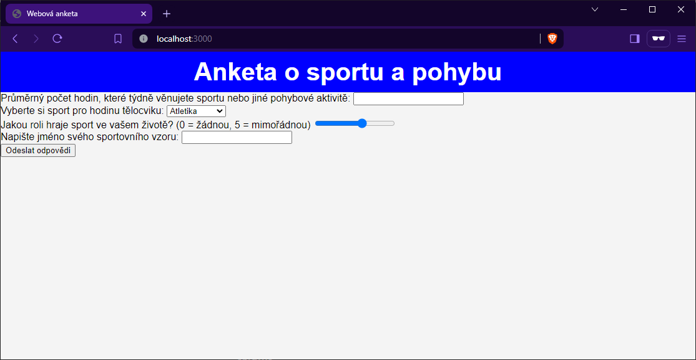

3. **Interaktivita formuláře**: Ve formuláři chybí u třetí otázky (prvek `<input type="range">`) číselné zobrazení hodnoty, kterou si uživatel vybral. 

    *Řešení:*

    Pro zobrazení průběžně vybrané hodnoty u prvku s id="importance" (což by v našem případě mohla být škála od 0 do 5 pro otázku o roli sportu v životě respondentů) můžete použít JavaScript k aktualizaci textu nebo jiného elementu na stránce, který bude zobrazovat vybranou hodnotu.

    Zde je příklad, jak toho dosáhnout:

    Přidání elementu pro zobrazení vybrané hodnoty: Do vašeho formuláře v index.ejs (nebo jiného relevantního souboru) přidejte element, kam bude JavaScript vypisovat vybranou hodnotu. Tento element může být `<span>`, `<div>` nebo jakýkoliv jiný vhodný HTML element. Přidejte mu unikátní `id` pro snadný přístup pomocí JavaScriptu.

    ```
    <label for="importance">Jakou roli hraje sport ve vašem životě? (škála 0 až 5): </label>
    <input type="range" id="importance" name="importance" min="0" max="5" step="1">
    <span id="importanceValue"></span>
    ```

    Přidání JavaScriptu pro aktualizaci hodnoty: Do souboru `index.ejs` přidejte na konci těla stránky následující JS kód. Tento kód bude poslouchat na události změny (`change` a `input`) u `<input type="range">` a aktualizovat text elementu, který má `id="importanceValue"`, na aktuálně vybranou hodnotu.

    ```
    <script>
    const slider = document.getElementById('importance');
    const output = document.getElementById('importanceValue');
    output.innerHTML = slider.value; // Zobrazit výchozí hodnotu

    slider.oninput = function() {
        output.innerHTML = this.value;
    }
    </script>
    ```

    V tomto příkladu, kdykoliv uživatel posune posuvník, hodnota uvnitř elementu s `id="importanceValue"` se aktualizuje na aktuálně vybranou hodnotu. Kód `slider.oninput = function() {...}` zajišťuje, že se hodnota aktualizuje v reálném čase, jakmile uživatel posouvá posuvník, což poskytuje okamžitou zpětnou vazbu.

    Tento přístup můžete použít pro jakýkoliv prvek formuláře, u kterého chcete zobrazovat průběžně vybranou nebo zadanou hodnotu, a lze ho jednoduše přizpůsobit pro různé typy vstupních prvků.

    Po zadání: [http://localhost:3000/](http://localhost:3000/) se objeví upravená podoba úvodní stránky (červeně je zvýrazněn přidaný prvek):
   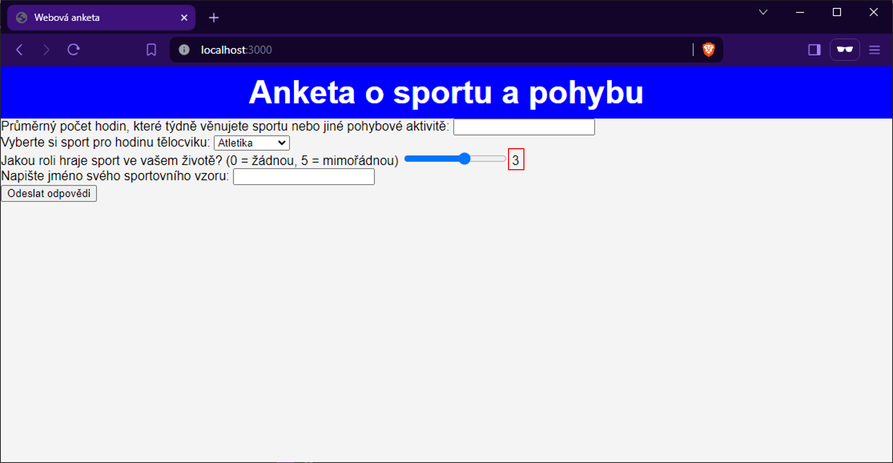

4. **Úprava vzhledu formuláře**: 

Pro hezkou a moderní úpravu formuláře můžeme použít CSS, které zvýrazní jednotlivé prvky formuláře, zlepší celkovou čitelnost a zvýší uživatelský komfort. Zde je několik CSS pravidel, které můžete přidat do souboru `styles.css` ve složce `public`. 

```
... 
.form-container {
    background-color: #fff;
    padding: 20px;
    border-radius: 8px;
    box-shadow: 0 2px 4px rgba(0, 0, 0, 0.1);
    max-width: 600px;
    margin: 20px auto;
}

label {
    font-weight: bold;
    display: block;
    margin-bottom: 5px;
}

input[type=text],
input[type=number],
select,
input[type=range] {
    width: 80%;
    padding: 10px;
    margin-bottom: 20px;
    border-radius: 5px;
    border: 1px solid #ddd;
    box-sizing: border-box;
}

input[type=range] {
    -webkit-appearance: none;
    width: 80%;
    height: 8px;
    border-radius: 5px;
    background: #ddd;
    outline: none;
    opacity: 0.7;
    -webkit-transition: .2s;
    transition: opacity .2s;
}

input[type=range]::-webkit-slider-thumb {
    -webkit-appearance: none;
    appearance: none;
    width: 20px;
    height: 20px;
    border-radius: 50%;
    background: #4CAF50;
    cursor: pointer;
}

input[type=range]::-moz-range-thumb {
    width: 20px;
    height: 20px;
    border-radius: 50%;
    background: #4CAF50;
    cursor: pointer;
}

input[type=submit] {
    font-size: 16px;
    background-color: #4CAF50;
    color: white;
    padding: 12px 20px;
    border: none;
    border-radius: 5px;
    cursor: pointer;
    margin-top: 10px;
}

input[type=submit]:hover {
    background-color: #45a049;
}

#importanceValue {
    margin-left: 10px;
    font-weight: bold;
    background-color: #333;
    color: #fff;
    padding: 10px;
    border-radius: 20px;
}
```

Tento CSS kód poskytuje základní styly pro formulář a jeho prvky, včetně zlepšení vzhledu posuvníku a tlačítka pro odeslání. U posuvníku (`input[type=range]`) jsme odstranili výchozí vzhled a přidali vlastní styly pro lepší vizuální prezentaci.

Pamatujte, že tyto styly jsou jen základem a můžete je dále přizpůsobit podle potřeb vašeho formuláře a celkového designu webu. Můžete například upravit barvy, fonty nebo okraje, aby lépe odpovídaly vaší značce nebo preferencím.

    Po zadání: [http://localhost:3000/](http://localhost:3000/) se objeví upravená podoba formuláře, který můžeme zkusit vyplnit údaji:
   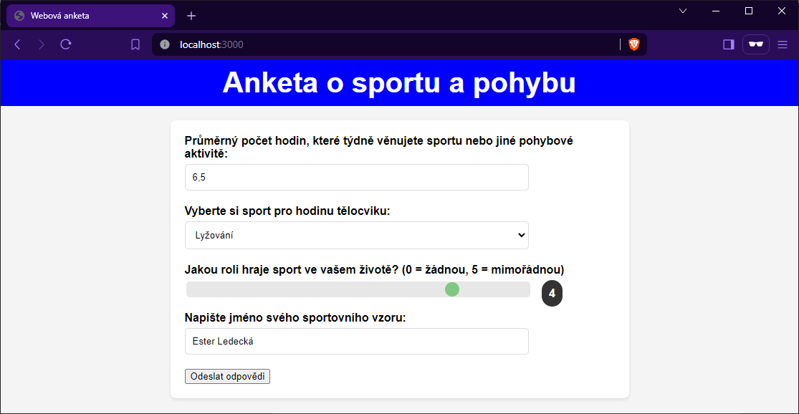

---
### Uložení dat na serveru

Pro uložení odpovědí z ankety do souboru `responses.json` vytvoříme v naší Node.js aplikaci funkci, která zpracuje data odeslaná z formuláře, přidá je do stávajícího seznamu odpovědí v souboru responses.json a ten aktualizuje. Tento proces zahrnuje čtení souboru, parsování JSON dat, přidání nové odpovědi a opětovné uložení dat do souboru.

1. **Vytvoření JSON souboru**: V kořenové složce našeho webu vytvoříme soubor `responses.json`, který bude na začátku obsahovat poze prázdné hranaté závorky (prázdné pole):

 *responses.json*
 ```
 []
 ```

Do tohoto souboru bude serverová aplikace postupně zapisovat datové objekty. 

2. **Ukládání dat do souboru**: V souboru `server.js`, implementujme logiku pro zpracování POST požadavku z formuláře:

```
... 
/* Routa pro zpracování dat z formuláře */
app.post("/submit", (req, res) => {
  // Zde budeme ukládat data z formuláře do souboru responses.json
  const newResponse = {
    id: Date.now(), // Jednoduchý způsob, jak generovat unikátní ID
    timestamp: new Date().toISOString(),
    answers: req.body, // Předpokládáme, že všechny odpovědi jsou ve formátu, který chceme uložit
  };

  // Čtení stávajících dat z souboru
  fs.readFile("responses.json", (err, data) => {
    if (err) throw err;
    let json = JSON.parse(data);
    json.push(newResponse);

    // Zápis aktualizovaných dat zpět do souboru
    fs.writeFile("responses.json", JSON.stringify(json, null, 2), (err) => {
      if (err) throw err;
      console.log("Data byla úspěšně uložena.");
      res.redirect("/results"); // Přesměrování na stránku s výsledky
    });
  });
});
... 
```

*Poznámky k řešení:*
- *ID ankety*: V tomto příkladu generujeme ID ankety použitím časového razítka `Date.now()`. Toto není nejlepší řešení pro všechny případy, zejména pokud je aplikace používána ve velkém měřítku, ale pro účely ukázky je to dostatečné.
- *Timestamp*: Přidáváme timestamp kdy byla anketa odeslána, což pomáhá s organizací a analýzou dat.
- *Přesměrování na stránku s výsledky*: Po uložení dat přesměrujeme uživatele na stránku s výsledky, což uživatelům umožňuje vidět agregované výsledky ankety.
- *Zpracování chyb*: Jednoduché zpracování chyb je implementováno, ale pro produkční použití byste měli zvážit robustnější řešení.

3. **Ověření funkčnosti**:
- Restartujeme server. 
- V prohlížeči vyvoláme domovskou stránku a vyplníme formulář daty. 
- Po odeslání formuláře by se v případě úspěchu měla objevit zatím prázdná stránka s výsledky. 
- Soubor `responses.json` by měl obsahovat první datový objekt:

```
[
  {
    "id": 1710794019428,
    "timestamp": "2024-03-18T20:33:39.428Z",
    "answers": {
      "hours": "6.5",
      "sport": "lyžování",
      "importance": "4",
      "roleModel": "Ester Ledecká"
    }
  }
]
```

Můžeme odeslat ještě další dva pokusy, abychom soubor naplnili větším počtem záznamů. 

---
### Výpis výsledků ankety

Pro výpis výsledků ankety v podobě tabulky, která obsahuje všechna uložená data, můžete postupovat následovně. Vytvoříme EJS šablonu, která projde uložená data v responses.json a dynamicky vygeneruje tabulku. Datum a čas budou zobrazeny ve formátu běžném pro české prostředí, tedy dd.mm.yyyy hh:mm:ss.

1. **Čtení dat ze souboru**:

Nejprve musíme načíst data z `responses.json` na serveru v souboru `index.js`, když uživatel přistoupí na stránku s výsledky. Tato data poté předáme do *EJS šablony* `results.ejs`.

```
/* Routa pro zobrazení výsledků ankety */
app.get("/results", (req, res) => {
  // Zde bude načtení dat ze souboru responses.json a jejich předání do šablony
  fs.readFile('responses.json', 'utf8', (err, data) => {
    if (err) {
      console.error(err);
      return res.status(500).send('Nastala chyba při čtení dat.');
    }
    const responses = JSON.parse(data);
    res.render('results', { responses }); // Předání dat-odpovědí šabloně results.ejs
  });
});
```
2. **Zobrazení výsledků v šabloně**:

Nyní upravíme soubor `results.ejs` ve složce `views` tak, aby obsahoval kód pro vykreslení tabulky. Využijeme k tomu možnosti šablonovacího systému **EJS**:

[Dokumentace k `EJS`](https://ejs.co/#docs)

Pro konverzi data a času z ISO formátu do českého formátu můžete použít nativní JS funkci `Date` a její metody pro získání jednotlivých částí data a času. V produkčním prostředí můžete zvážit použití knihoven jako je [`Moment.js`](https://momentjs.com/).

*Úprava results.ejs*
```
... 
    <h1>Výsledky ankety</h1>
    <table border="1">
        <tr>
            <th>ID</th>
            <th>Datum</th>
            <th>Čas</th>
            <th>Hodiny týdně</th>
            <th>Zaměření TV</th>
            <th>Význam sportu</th>
            <th>Sportovní vzor</th>
        </tr>
        <% responses.forEach(function(response) { 
            const date = new Date(response.timestamp);
            const dateString = `${('0' + date.getDate()).slice(-2)}.${('0' + (date.getMonth() + 1)).slice(-2)}.${date.getFullYear()}`;
            const timeString = `${('0' + date.getHours()).slice(-2)}:${('0' + date.getMinutes()).slice(-2)}:${('0' + date.getSeconds()).slice(-2)}`;
        %>
            <tr>
                <td><%= response.id %></td>
                <td><%= dateString %></td>
                <td><%= timeString %></td>
                <td><%= response.answers.hours %></td>
                <td><%= response.answers.sport %></td>
                <td><%= response.answers.importance %></td>
                <td><%= response.answers.roleModel %></td>
            </tr>
        <% }); %>
    </table>    
...    
```

Tento kód projde pole `responses`, které bylo předáno do šablony z našeho serveru, a pro každou odpověď vygeneruje řádek v tabulce. Datum a čas jsou formátovány do českého standardu. 

*Zobrazení výsledků ankety:*
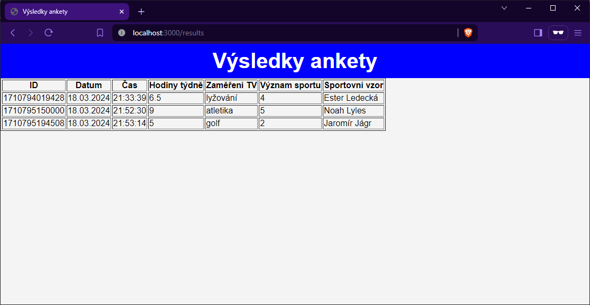

3. **Úprava vzhledu tabulky s výsledky**:

Pro vylepšení vzhledu tabulky s výsledky ankety pomocí CSS můžete použít následující CSS pravidla. Tato pravidla přidávají stylování pro lepší čitelnost a estetický vzhled tabulky, včetně zarovnání obsahu, zvýraznění řádků při najetí myši, a ohraničení buněk.

```
... 
/* Úprava vzhledu tabulky */
table {
    width: 100%;
    border-collapse: collapse;
    margin-top: 20px;
    box-shadow: 0 2px 3px rgba(0, 0, 0, 0.1);
}

th,
td {
    padding: 8px;
    text-align: left;
    border-bottom: 1px solid #ddd;
}

th {
    background-color: #4CAF50;
    color: white;
}

tr:nth-child(even) {
    background-color: #f2f2f2;
}

tr:hover {
    background-color: #ddd;
}

/* Přidáváme trochu paddingu na stránky pro lepší vzhled */
.container {
    max-width: 960px;
    margin: auto;
    background-color: #fff;
    padding: 20px;
    border-radius: 8px;
}
...   
```

Třídu `.container` můžeme v souboru `results.ejs` použít ve značce `<div class="container">`, kterou "obalíme" celou tabulku:

```
... 
    <div class="container">
        <table>
          ... 
        </table>
    </div>    
...     
```

*Upravená tabulka vypadá takto:*
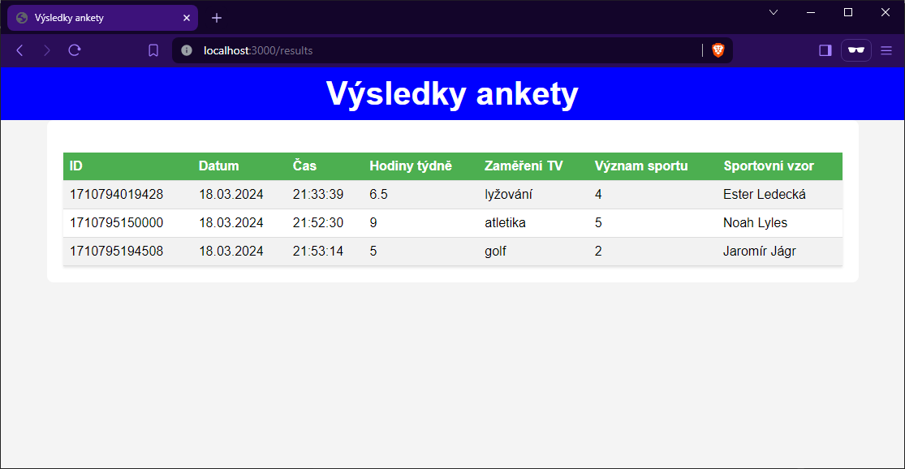

---
### Bloky v šabloně EJS

Vnoření bloků v EJS umožňuje rozdělit EJS šablony na menší, opakovaně použitelné části. Tento přístup vám umožní udržet vaše kódové základy přehledné a snadno udržovatelné, protože můžete oddělit logické části vašeho webu do samostatných souborů, které pak můžete znovu vkládat do různých šablon.

*Výhody vnoření bloků*

- *Údržba:* Snadnější údržba a aktualizace, protože změny v opakovaně použitelných komponentách se projeví ve všech šablonách, kde jsou tyto komponenty vloženy.
- *Přehlednost:* Udržuje hlavní šablony čisté a přehledné tím, že odstraňuje opakovaný kód a umožňuje soustředit se na specifický obsah dané stránky.
- *Opakované použití:* Umožňuje snadné opakované použití kódu napříč projektem bez nutnosti kopírování a vkládání.

1. **Vytvoření samostatných bloků pro header a footer**:

Typické využití je mít v aplikaci společný header a footer. Tyto části můžete umístit do samostatných souborů, například `views/blocks/header.ejs` a `views/blocks/footer.ejs`, a vložit je do každé stránky:

*header.ejs*
```
<header>
    <h1><%= title %></h1>
</header>
```

*footer.ejs*
```
<footer>
    <p>&copy; 2024 Marek Lučný, pro třídu IT2 do předmětu PVY</p>
    <p></p>
</footer>
```

Obrázek školního loga je v tomto případě třeba umístit do složky `images`, která je podsložkou `public`.

2. **Použití bloků v šablonách**:

Připravené bloky můžeme připojit v šablonách `index.ejs` a `results.ejs` tímto způsobem:

```
<%- include('blocks/header'); -%>
<!-- Obsah stránky -->
<%- include('blocks/footer'); -%>
```
3. **Předávání titulku/nadpisu šabloně**

S ohledem na strukturu bloku/šablony `header.ejs` je nutné v `index.js` předávat proměnnou `title` při renderování šablon index a results:

```
... 
res.render("index", { title: "Webová anketa" }); 
... 
res.render('results', { title: "Výsledky ankety", responses });
... 
```

Po této úpravě a po dalších úpravách CSS mohou být stránky v takové podobě:

*Úvodní stránka:*
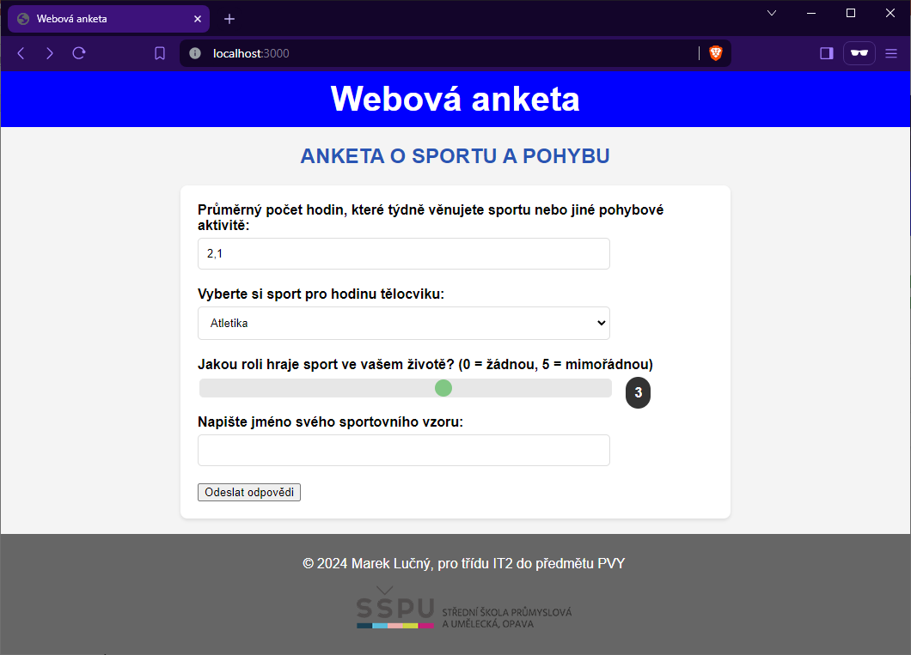

*Stránka s výsledky:*
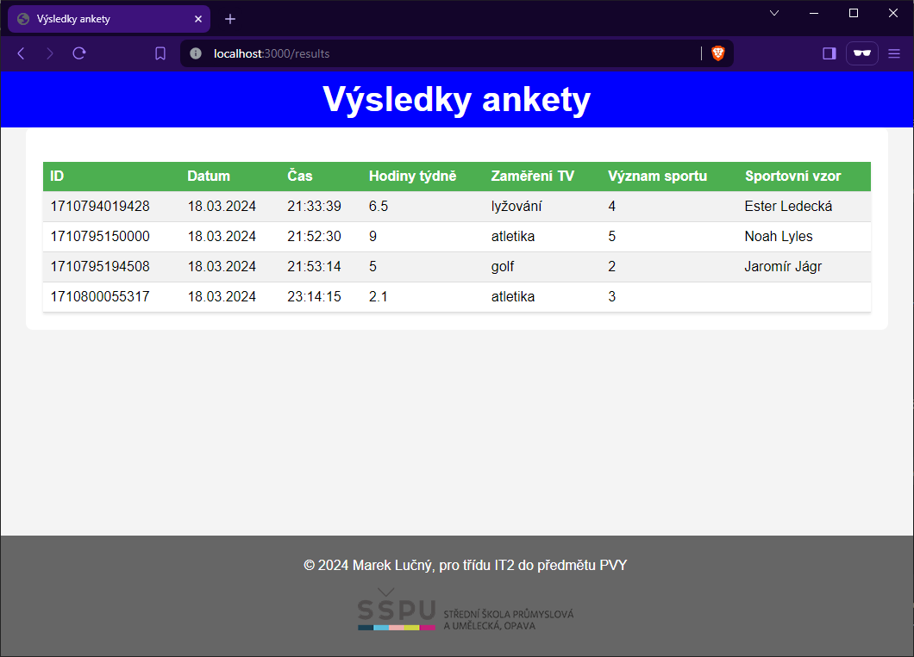